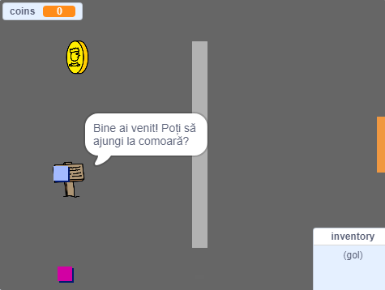

## Ce urmează?

Încearcă proiectul [Creează-ți propria lume](https://projects.raspberrypi.org/ro-RO/projects/create-your-own-world?utm_source=pathway&utm_medium=whatnext&utm_campaign=projects), unde îți vei crea propriul joc de aventură!

--- no-print ---

Dă click pe steagul verde pentru a începe. Folosește săgețile pentru a muta personajul tău în jurul lumii.

  <iframe allowtransparency="true" width="485" height="402" src="https://scratch.mit.edu/projects/embed/258757783/?autostart=false" frameborder="0" scrolling="no"></iframe>
  

--- /no-print ---

--- print-only ---

Vei folosi săgețile pentru a muta personajul tău în aceasta lume. 

--- /print-only ---

**Traducere realizată de comunitate**

Proiectul a fost tradus de **Andra Popescu** și verificat de **Gelu Ungur**.

Traducătorii noștri voluntari ne ajută să oferim copiilor din întreaga lume șansa de a învăța să programeze. Ne poți ajuta să ajungem la mai mulți copii, ajutând la traducerea proiectelor noastre – află mai multe pe rpf.io/translators.