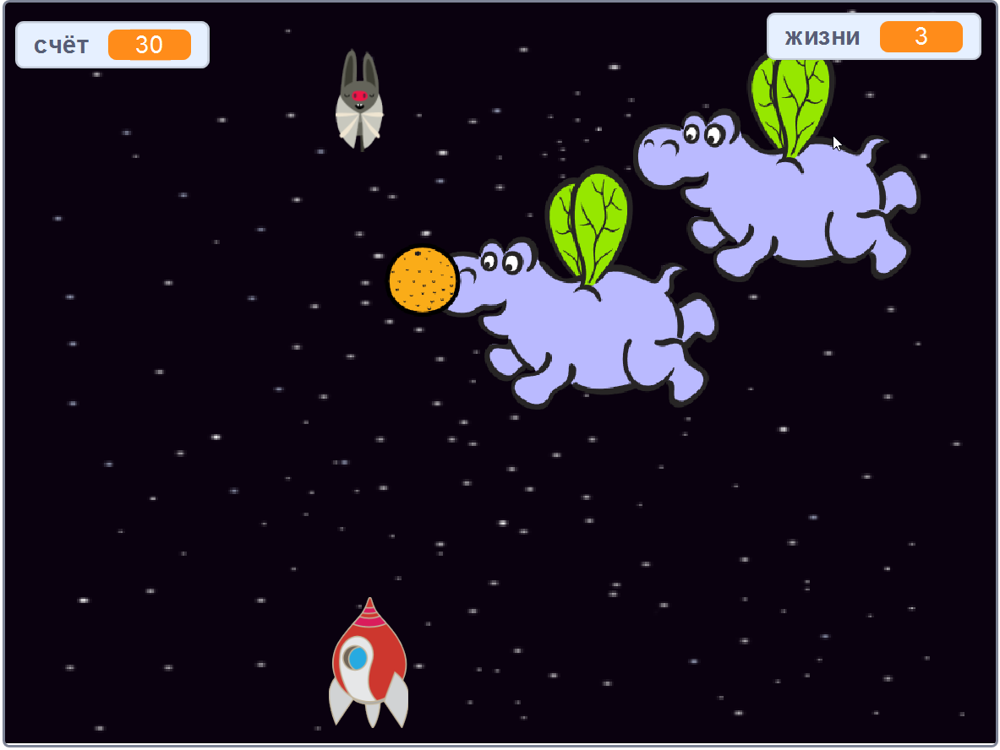

\--- no-print \---

Это версия проекта **Скретч 3**. Существует также [версия проекта Скретч 2](https://projects.raspberrypi.org/en/projects/clone-wars-scratch2).

\--- /no-print \---

## Введение

В этом проекте ты узнаешь, как создать игру, в которой необходимо спасти планету Земля от космических монстров.

### Что тебе нужно сделать

\--- no-print \---

Нажми на зеленый флаг в примере игры ниже, чтобы её начать, а затем нажми <kbd>влево</kbd> и <kbd>вправо</kbd> клавиши со стрелками для перемещения космического корабля и клавишу <kbd>пробел</kbd>, чтобы стрелять.

  <iframe allowtransparency="true" width="485" height="402" src="https://scratch.mit.edu/projects/embed/276887163/?autostart=false" frameborder="0" scrolling="no"></iframe>
  

\--- /no-print \---

Набери, как можно больше очков, стреляя в космических бегемотов. Если тебя ударит бегемот или апельсин, брошенный летучими мышами, ты потеряешь жизнь.

\--- print-only \---

\--- /print-only \---

## \--- collapse \---

## title: What you will need

### Оборудование

+ Компьютер с поддержкой Скретч 3

### Программное обеспечение

+ Скретч 3 (либо [онлайн-редактор](https://rpf.io/scratchon){:target="_blank"}, либо [автономный редактор (без подключения к Интернету)](https://rpf.io/scratchoff){:target="_blank"})

### Загрузки

[Find the downloads here](http://rpf.io/p/en/clone-wars-go).

\--- /collapse \---

## \--- collapse \---

## title: What you will learn

+ Как сделать перемещение спрайтов с помощью клавиатуры
+ Как клонировать спрайты, чтобы сделать их копии
+ Как использовать "передать" и "получить блоки" для отправки сообщений

\--- /collapse \---

## \--- collapse \---

## title: Additional notes for educators

\--- no-print \---

If you need to print this project, please use the [printer-friendly version](https://projects.raspberrypi.org/en/projects/clone-wars/print){:target="_blank"}.

\--- /no-print \---

You can find the [completed project here](http://rpf.io/p/en/clone-wars-get).

\--- /collapse \---