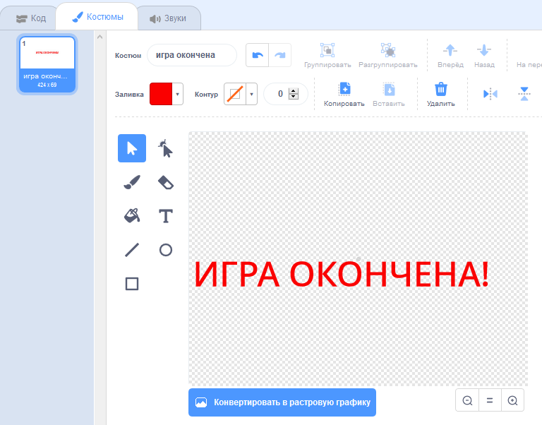
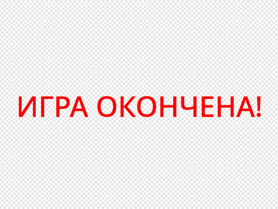

## Игра окончена

Далее тебе необходимо добавить сообщение 'игра окончена' в конце игры.

\--- task \---

Если ты ещё этого не сделал, то создай новую переменную с именем `жизни` {: Класс = "block3variables"}.

Твой космический корабль должен стартовать с тремя жизнями и терять жизнь всякий раз, когда он касается бегемота или апельсина. Твоя игра должна остановиться, когда `жизни` {: class = "block3variables"} закончатся.

\--- /task \---

\--- task \---

Нарисуй новый спрайт под названием ` Игра окончена ` используя инструмент ** текст **.



\--- /task \---

\--- task \---

На Сцене передай сообщение ` игра окончена ` {: class = "block3events"} непосредственно перед окончанием игры.


```blocks3
передать (игра окончена) и ждать до конца
```

\--- /task \---

\--- task \---

Добавь этот код в свой спрайт ` игра окончена `, чтобы он показался в конце игры:



```blocks3
когда флаг нажат
спрятаться

когда я получу [игра окончена]
показаться
```

Поскольку ты использовал блок ` передать (игра окончена) и ждать до конца `{:class="block3events"} на своей Сцене, Сцена будет ждать спрайт `Игра окончена`, чтобы отобразить его перед окончанием игры.

\--- /task \---

\--- task \---

Проверь свою игру. Сколько очков ты можешь набрать? Если игра слишком простая или слишком сложная, можешь ли ты придумать, как ее улучшить?

\--- /task \---