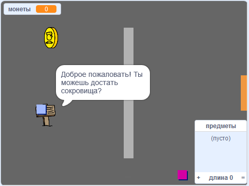

## Что дальше?

Перейди на наш проект [ Создай свой собственный мир ](https://projects.raspberrypi.org/en/projects/create-your-own-world?utm_source=pathway&utm_medium=whatnext&utm_campaign=projects), где ты создашь свою собственную приключенческую игру!

\--- no-print \---

Нажми на зеленый флаг, чтобы начать. Используй клавиши со стрелками для перемещения своего персонажа по миру.

  <iframe allowtransparency="true" width="485" height="402" src="https://scratch.mit.edu/projects/embed/258757783/?autostart=false" frameborder="0" scrolling="no"></iframe>
  

\--- /no-print \---

\--- print-only \---

Используй клавиши со стрелками для перемещения своего персонажа по миру. 

\--- /print-only \---