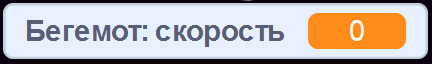
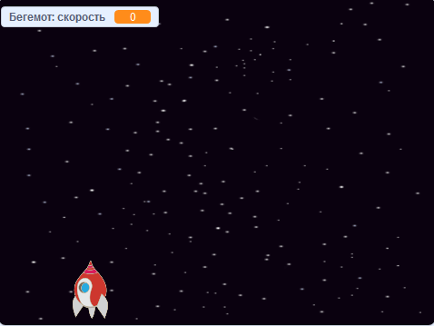

## Космические бегемоты

Теперь тебе нужно добавить много летающих бегемотов, которые будут пытаться уничтожить твой космический корабль.

\--- task \---

Создай новый спрайт с изображением Бегемота из библиотеки Скретч. Используй инструмент** уменьшение**, чтобы сделать размер спрайта `Бегемот` таким же, как и спрайт `Космический корабль`.


\--- /task \---

\--- task \---

Установи для спрайта `Бегемот` стиль вращения ** влево-вправо **.

[[[generic-scratch3-sprite-rotation-style]]]

\--- /task \---

\--- task \---

Добавь код, которые спрячет спрайт `Бегемота`, когда игра начинается.


```blocks3
когда зеленый флаг нажат
спрятать
```

\--- /task \---

\--- task \---

Добавь код, который будет создавать новый клон `Бегемота` каждые несколько секунд.

\--- hints \---

\--- hint \---

Когда `зелёный флаг нажат` {: class = "block3events"}, ` повторять всегда ` {: class = "block3control"} ` ждать ` {: class = "block3control"} ` от 2 до 4 секунд ` {: class = "block3operators"}, а затем ` создать клон спрайта Бегемот ` {: Класс = "block3control"}.

\--- /hint \---

\--- hint \---

Вот блоки, которые тебе понадобятся:

```blocks3
повторять всегда
конец

создать клон (Бегемот)

(выбрать случайное от (2) до (4))

когда флаг нажат

ждать () секунд
```

\--- /hint \---

\--- hint \---

Твой код должен выглядеть вот как:


```blocks3
когда флаг нажал
повторять всегда
    ждать (выдать случайное от (2) до (4)) секунд
    создай клон (Бегемот)
конец
```

\--- /hint \---

\--- /hints \---

\--- /task \---

Каждый новый клон бегемота должен появляться в случайном положении ` x ` и каждый клон должен иметь произвольную скорость.

\--- task \---

Создай новую переменную с именем ` скорость ` {: class = "block3variables"} только для спрайта ` Бегемот `.

[[[generic-scratch3-add-variable]]]

Если ты сделал это правильно, то переменная будет иметь имя спрайта, например:



\--- /task \---

\--- task \---

Когда создаётся клон ` Бегемота `, выбирается случайная скорость и стартовое место для него. Затем клон появляется на экране.

```blocks3
когда я начинаю как клон
задать [скорость] значение (выдать случайное от (2) до (4))
перейти в x: (выдать случайное от (-220) до (220)) y: (150)
показаться
```

\--- /task \---

\--- task \---

Проверь свой код. Новый бегемот появляется каждые несколько секунд?

\--- /task \---

В данный момент бегемоты не двигаются.

\--- task \---

Каждый бегемот должен передвигаться случайным образом до удара молнии. Чтобы это произошло, прикрепите этот код под блоками, которые уже находятся в скрипте спрайта ` Бегемот `:

```blocks3
повторять пока не <touching (lightning v) ?>
    идти (скорость :: переменные) шагов
    повернуть направо (выдать случайное от (-10) до (10)) градусов
    если касается края, оттолкнуться
конец
удалить клон
```

\--- /task \---

\--- task \---

Протестируй свой код еще раз. Ты должен видеть, что новый клон бегемота появляется каждые несколько секунд и каждый клон должен двигаться с разной скоростью.

\--- no-print \---



\--- /no-print \---

\--- /task \---

\--- task \---

Теперь проверь лазерную пушку космического корабля. Если молния попадёт в бегемота, то исчезнет ли бегемот?

\--- /task \---