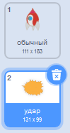
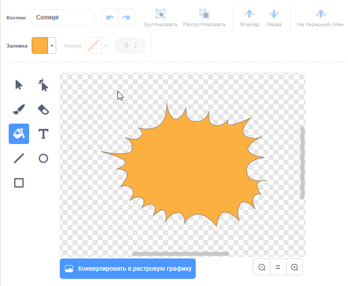

## Взрыв космического корабля

Когда бегемот касается твоего корабля, он должен взорваться!

\--- task \---

Выбери спрайт ` Космический корабль ` и переименуй его костюм в "обычный".

\--- /task \---

\--- task \---

Нарисуй костюм взрывающегося космического корабля и назови новый костюм «удар».



Если ты не хочешь рисовать взрыв, ты можешь выбрать костюм 'Солнце' из библиотеки Скретч, а затем использовать инструменты ** Изменение формы и цвета ** для изменения цвета костюма и его формы.



\--- /task \---

\--- task \---

Добавь код к спрайту ` Космический корабль `, чтобы он показывал «обычный» костюм при запуске игры и переключался на костюм «удар» при касании его бегемотом:


```blocks3
когда флаг нажат
изменить костюм на (обычный)
ждать до <touching (Hippo1 v)>?
изменить костюм на (удар)
```

\--- /task \---

\--- task \---

Проверь свой код. Сделай так, чтобы космический корабль столкнуться с бегемотом. Меняется ли космический корабль на костюм «удар»?

\--- /task \---