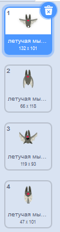
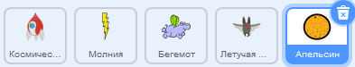
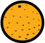

## Космическая летучая мышь

Чтобы сделать твою игру немного сложнее, тебе необходимо создать летучую мышь, которая бросает апельсины на космический корабль.


\--- task \---

Добавь спрайт ` Летучая мышь ` и установи для него стиль вращения ** влево-вправо **.

\--- /task \---

\--- task \---

Сделай так, чтобы спрайт ` Летучая мышь ` ` перемещался ` {:class="block3motion"} слева направо в верхней части Сцены ` всегда ` {:class="block3control"}.


```blocks3
когда флаг нажат
установить размер (50) %
повторять всегда
    идти (10) шагов
    если касается края, оттолкнуться
конец
```

Не забудь проверить свой код.

\--- /task \---

Если ты посмотришь на костюмы летучей мыши, то увидишь, что она имеет четыре разных костюма:



\--- task \---

Используй блок `следующий костюм` {:class="block3looks"}, чтобы летучая мышь взмахивала крыльями при движении.

\--- hints \---

\--- hint \---

После того, как летучая мышь начала двигаться, должен показываться `следующий костюм` {:class="block3looks"} и затем `ждать` {:class="block3control"} на короткое время.

\--- /hint \---

\--- hint \---

Тебе нужно будет добавить эти блоки в свой код:

```blocks3
ждать (0,3) секунд

следующий костюм
```

\--- /hint \---

\--- hint \--- Твой код должен выглядеть вот так:

```blocks3
когда флаг нажат
установить размер (50)%
повторять всегда
идти (10) шагов
если касается края, оттолкнуться

+ следующий костюм
+ ждать (0,3) секунд
конец
```

\--- /hint \---

\--- /hints \---

\--- /task \---

Теперь сделай так, чтобы летучая мышь бросала апельсины!

\--- task \---

Добавь спрайт ` Апельсин ` из библиотеки Скретч.



\--- /task \---

\--- task \---

Добавь код к своей летучей мыши, чтобы ` когда флаг нажат ` {:class="block3events"}, спрайт ` летучая мышь ` ` повторять всегда ` {:class="block3control"} ` ждать ` {:class=block3control"} для промежутка времени ` выдать случайное ` {:class="block3operators"} ` от 5 до 10 ` {:class="block3operators"} секунд, а затем ` создать клон ` {:class="block3control"} спрайта ` Апельсин `.


```blocks3
когда флаг нажат
повторять всегда
    ждать (выдать случайное от (5) до (10)) секунд
    создать клон (Апельсин)
конец
```

\--- /task \---

\--- task \---

Добавь код в ` Апельсин `, чтобы каждый из его клонов падал, начиная со спрайта ` летучей мыши ` и до уровня нижней части Сцены.



```blocks3
    когда флаг нажат
    спрятаться

    когда я начинаю как клон
    перейти на (Летучая мышь)
    показаться
    повторять пока не (касается (край)?
        изменить y на (-4)
    конец
    удалить клон
```

\--- /task \---

\--- task \---

Добавь еще немного кода в спрайт ` Апельсин ` для того, чтобы когда клон ` Апельсина ` ударяет спрайт ` Космический корабль `, клон также исчезнет, чтобы дать игроку возможность начать игру снова:


```blocks3
    когда я получу [удар]
удалить клон
```

\--- /task \---

\--- task \---

Измени код спрайта своего ` Космического корабля `, так что спрайт "ударился", когда он касается спрайта ` Бегемот ` или спрайта ` Апельсин `:


```blocks3
    ждать до <touching (Hippo1 v)?> или <touching (Orange v)?>
```

\--- /task \---

\--- task \---

Проверь свою игру. Что произойдет, если космический корабль столкнётся с падающим апельсином?

\--- /task \---