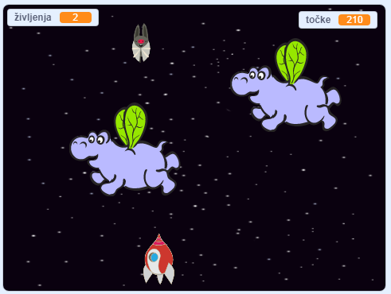

\--- no-print \---

To je **Scratch 3** različica projekta. Obstaja tudi [Scratch 2](https://projects.raspberrypi.org/en/projects/clone-wars-scratch2) različica projekta.

\--- /no-print \---

## Uvod

V tem projektu se boš naučil, kako ustvariti igro, v kateri moraš Zemljo rešiti pred vesoljskimi pošastmi.

### Kaj boš ustvaril?

\--- no-print \---

Klikni na zeleno zastavico, da zaženeš primer igre, ki se nahaja spodaj in nato pritiskaj <kbd>levo</kbd> ali <kbd>desno</kbd> smerno tipko za premikanje vesoljske ladje in tipko <kbd>presedek</kbd> za streljanje.

  <iframe allowtransparency="true" width="485" height="402" src="https://scratch.mit.edu/projects/embed/276887163/?autostart=false" frameborder="0" scrolling="no"></iframe>
  

\--- /no-print \---

Doseži čim več točk s streljanjem letečih vesoljskih povodnih konjev. Če te kateri od povodnih konjev zadane ali če te zadane pomaranča, ki jih mečejo netopirji, izgubiš življenje.

\--- print-only \---

\--- /print-only \---

## \--- collapse \---

## title: What you will need

### Strojna oprema

+ Računalnik, ki lahko poganja Scratch 3

### Programska oprema

+ Scratch 3 (bodisi [na spletu](https://rpf.io/scratchon) {:target = "_blank"} ali [brez povezave](https://rpf.io/scratchoff){:target = "_blank"})

### Prenosi

[Find the downloads here](http://rpf.io/p/en/clone-wars-go).

\--- /collapse \---

## \--- collapse \---

## title: What you will learn

+ Premikati figure s pomočjo tipkovnice
+ Podvajati figure, da ustvarjaš njihove kopije
+ Uporabiti bloke 'objavi' in 'prejmi' za pošiljanje sporočil

\--- /collapse \---

## \--- collapse \---

## title: Additional notes for educators

\--- no-print \---

If you need to print this project, please use the [printer-friendly version](https://projects.raspberrypi.org/en/projects/clone-wars/print){:target="_blank"}.

\--- /no-print \---

You can find the [completed project here](http://rpf.io/p/en/clone-wars-get).

\--- /collapse \---