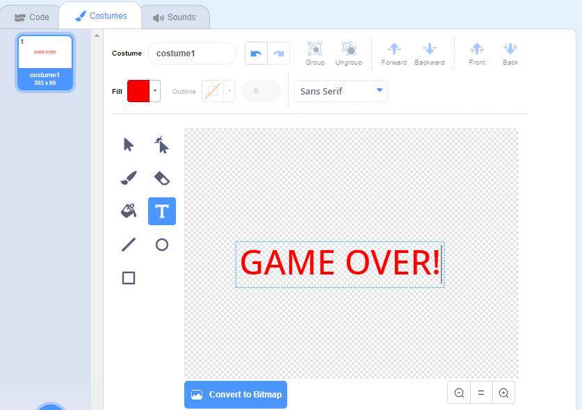

## Konec igre

V naslednjem koraku dodaj poročilo 'konec igre' na konec igre.

\--- task \---

Če tega še nisi storil-a, dodaj novo spremenljivko ienovan `življenja`{:class="block3variables"}.

Raketa naj ima na začetku tri življenja, po eno pa izgubi vsakič, ko se dotakne povodnega konja ali pomaranče. Igra naj se zaustavi, ko ni več `življenj`{:class="block3variables"}.

\--- /task \---

\--- task \---

Nariši novo figuro imenovano `Konec igre` s pomočjo orodja za pisanje **teksta**.



\--- /task \---

\--- task \---

Na odru objavi sporočilo `konec igre`{:class="block3events"}, tik prede se igra konča.


```blocks3
objavi (konec igre v) in čakaj
```

\--- /task \---

\--- task \---

Figuri `konec igre` dodaj to kodo, da se pokaže ob koncu igre:


```blocks3
ko kliknemo na zastavo
skrij

ko prejmem [konec igre v]
pokaži
```

Zaradi bloka v odru `objavi (konec) igre in čakaj`{:class="block3events"}, bo oder poačakal na figuro `konec igre`, da se ta pokaže še preden se igra konča.

\--- /task \---

\--- task \---

Preizkusi igro. Koliko točk lahko dosežeš? Če je igra prelahka ali pretežka, si izmisli načine, da jo izboljšaš.

\--- /task \---