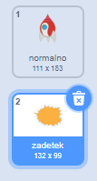

## Eksplozija rakete

Ko se povodni konj dotakne tvoje rakete, mora ta eksplodirati!

\--- task \---

Izberi figuro `Raketa` in preimenuje njen videz v 'normalno'.

\--- /task \---

\--- task \---

Nariši še en videz rakete, ki eksplodira in poimenuj novi videz 'zadetek'.



Če ne želiš narisati eksplozije, lahko izbereš videz 'sonce' iz Scratch knjižnice in potem uporabiš orodje za **barvanje likov**, da spremeniš barvo in obraz videza.


\--- /task \---

\--- task \---

Figuri tvoje `rakete` dodaj kodo, ki bo prikazala videz 'normalno', ko se igra začne in bo preklopila na videz 'zedetek', ko se dotakne povodnega konja:


```blocks3
ko kliknemo na zastavo
zamenjaj videz na (normalno v)
počakaj dokler ni <se dotika (povodni v)>?
zamenjaj videz na (zadetek v)
```

\--- /task \---

\--- task \---

Preizkusi svojo kodo. Z raketo trči v povodnega konja. Ali se videz rakete spremeni v 'zadetek'?

\--- /task \---