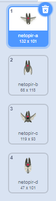
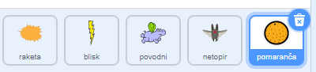

## Vesoljski netopir

Da narediš svojo igor nekoliko bolj težavno, boš ustvaril še netopirja, ki na raketo meče pomaranče.


\--- task \---

Dodaj figuro `netopir` in določi njegov slog vrtenja na **levo-desno**.

\--- /task \---

\--- task \---

Naredi, da se bo figura `netopir` `premikala`{:class="block3motion"} iz leve v desno na vrhu odra in da se bo to `ponavljalo`{:class="block3control"}.


```blocks3
ko kliknemo na zastavo
nastavi velikost na (50)%
ponavljaj
  pojdi (10) korakov
  odbij se, če si na robu
konec
```

Ne pozabi preizkusiti svoje kode.

\--- /task \---

Če si ogledaš videze netopirja, boš videl, da so štirje različni:



\--- task \---

Uporabi blok `naslednji videz`{:class="block3looks"}, da bo netopir mahal s krili, medtem ko se bo premikal.

\--- hints \---

\--- hint \---

Po tem, ko se premakne, bi moral pokazati `naslednji videz`{:class="block3looks"} in `počakati`{:class="block3control"} kratek čas.

\--- /hint \---

\--- hint \---

Svoji kodi moraš dodati te bloke:

```blocks3
počakaj (0.3) sekund

naslednji videz
```

\--- /hint \---

\--- hint \---

You code should look like this:

```blocks3
ko kliknemo na zastavo
nastavi velikost na (50)%
ponavljaj
pojdi (10) korakov
odbij se, če si na robu

+ naslednji videz
+ počakaj (0.3) sekund
konec
```

\--- /hint \---

\--- /hints \---

\--- /task \---

Now make the bat throw oranges!

\--- task \---

Add an `Orange` sprite from the Scratch library.



\--- /task \---

\--- task \---

Add code to your bat so that `when the flag is clicked`{:class="block3events"}, the `Bat` sprite `forever`{:class="block3control"} `waits`{:class="block3control"} for a `random`{:class="block3operators"} length of time between `5 to 10`{:class="block3operators"} seconds and then `creates a clone`{:class="block3control"} of the `Orange` sprite.


```blocks3
ko kliknemo na zastavo
pomavljaj
  počakaj (naključno število med (5) in (10)) sekund
  ustvari dvojnika (pomaranča v)
konec
```

\--- /task \---

\--- task \---

Add code to the `Orange` to make each of its clone drop, starting from the `Bat` sprite and falling towards the bottom of the Stage.


```blocks3
    ko kliknemo na zastavo
  skrij

  ko začnem kot dvojnik
  pojdi na (netopir v)
  pokaži
  ponavljaj do <se dotika (roba v)?>
    spremeni za (-4)
konec
zbriši tega dvojnika
```

\--- /task \---

\--- task \---

Add some more code to the `Orange` sprite so that when an `Orange` clone hits the `Spaceship` sprite, the clone also disappears to give the player a chance to reset:


```blocks3
    ko prejmem [zadetek v]
   zbriši tega dvojnika
```

\--- /task \---

\--- task \---

Modify the code of your `Spaceship` sprite so that the sprite is "hit" when it touches a `Hippo` sprite or an `Orange` sprite:


```blocks3
    počakaj dokler ni <<se dotika (povodni v)>? ali <se dotika (pomaranča v)>?>
```

\--- /task \---

\--- task \---

Test your game. What happens if the spaceship gets hit by a falling orange?

\--- /task \---