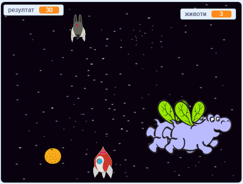

\--- no-print \---

Ово је **Scratch 3** верзија пројекта. Постоји, такође, и [Scratch 2 верзија пројекта](https://projects.raspberrypi.org/en/projects/clone-wars-scratch2).

\--- /no-print \---

## Увод

У овом пројекту научићеш како да направиш игру у којој треба да спасиш Земљу од свемирских чудовишта.

### Шта ћеш направити

\--- no-print \---

Кликни на зелену заставицу у примеру испод да покренеш игру, а затим притисни тастере са стрелицама <kbd>лево</kbd> и <kbd>десно</kbd> да помериш свемирски брод и тастер <kbd>размак</kbd> да пуцаш.

  <iframe allowtransparency="true" width="485" height="402" src="https://scratch.mit.edu/projects/embed/276887163/?autostart=false" frameborder="0" scrolling="no"></iframe>
  

\--- /no-print \---

Постигни што више поена гађајући летеће свемирске нилске коње. Ако те удари нилски коњ или погоди наранџа коју су бацили шишмиши, губиш један живот.

\--- print-only \---

\--- /print-only \---

## \--- collapse \---

## title: What you will need

### Хардвер

+ Рачунар који може да покрене Scratch 3

### Софтвер

+ Scratch 3 ([на мрежи](https://rpf.io/scratchon){:target="_blank"} или [ван мреже](https://rpf.io/scratchoff){:target="_blank"})

### Преузимање

[Find the downloads here](http://rpf.io/p/en/clone-wars-go).

\--- /collapse \---

## \--- collapse \---

## title: What you will learn

+ Како да помераш ликове користећи тастатуру
+ How to clone sprites to make copies of them
+ Како користити блокове 'разгласи' и 'прими' за слање поруке

\--- /collapse \---

## \--- collapse \---

## title: Additional notes for educators

\--- no-print \---

If you need to print this project, please use the [printer-friendly version](https://projects.raspberrypi.org/en/projects/clone-wars/print){:target="_blank"}.

\--- /no-print \---

You can find the [completed project here](http://rpf.io/p/en/clone-wars-get).

\--- /collapse \---