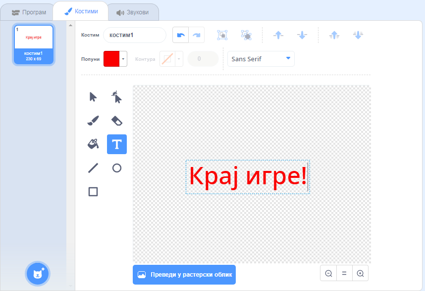

## Крај игре

Next, you're going to add a 'game over' message at the end of the game.

\--- task \---

Ако већ ниси, креирај нову променљиву која ће се звати `животи`{:class="block3variables"}.

Твој свемирски брод би требао да почне са три живота и изгуби живот сваки пут када дотакне нилског коња или наранџу. Твоја игра би требала да се заустави када понестане `животи`{:class="block3variables"}.

\--- /task \---

\--- task \---

Draw a new sprite called `Game Over` using the **text** tool.



\--- /task \---

\--- task \---

On the Stage, broadcast a `game over`{:class="block3events"} message just before the game ends.


```blocks3
разгласи (Крај игре v) и чекај
```

\--- /task \---

\--- task \---

Add this code to your `Game Over` sprite so that it shows at the end of the game:


```blocks3
када је кликнуто на ⚑
сакриј

када примим [Крај игре v]
прикажи
```

Because you've used a `broadcast (game over) and wait`{:class="block3events"} block on your Stage, the Stage will wait for the `Game Over` sprite to be displayed before ending the game.

\--- /task \---

\--- task \---

Test your game. How many points can you score? If the game is too easy or too hard, can you think of ways to improve it?

\--- /task \---