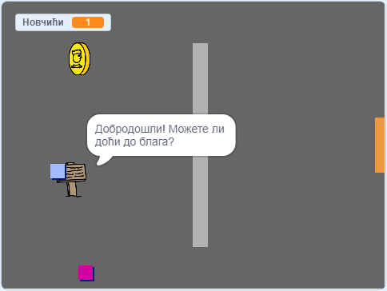

## Шта даље?

Баци поглед на пројекат [Креирај сопствени свет](https://projects.raspberrypi.org/en/projects/create-your-own-world?utm_source=pathway&utm_medium=whatnext&utm_campaign=projects), где ћеш креирати своју авантуристичку игру!

\--- no-print \---

Кликни на зелену заставицу да почнеш. Користи тастере са стрелицама за кретање твог лика по свету.

  <iframe allowtransparency="true" width="485" height="402" src="https://scratch.mit.edu/projects/embed/258757783/?autostart=false" frameborder="0" scrolling="no"></iframe>
  

\--- /no-print \---

\--- print-only \---

You'll use the arrow keys to move your character around in the world. 

\--- /print-only \---