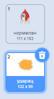
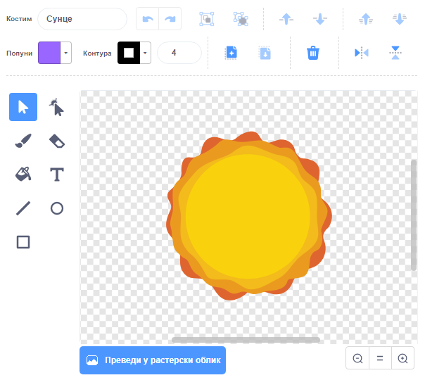

## Експлозија свемирског брода

Када нилски коњ додирне твој свемирски брод, свемирски брод би требао да експлодира!

\--- task \---

Одабери лик `Свемирски брод` и промени назив његовог костима у 'нормалан'.

\--- /task \---

\--- task \---

Draw another costume of an exploding spaceship, and call the new costume 'hit'.



Ако не желиш да нацрташ експлозију, можеш одабрати костим 'Сунце' из библиотеке Скреча, а затим употребити алат **Обоји облик** за промену боје и лица костима.



\--- /task \---

\--- task \---

Add some code to your `Spaceship` sprite so that it displays the 'normal' costume when the game starts, and switches to the 'hit' costume when it touches a hippo:


```blocks3
када је кликнуто на ⚑
замени костим са (нормалан v)
чекај док не <touching (Hippo1 v)>?
замени костим са (ударац v)
```

\--- /task \---

\--- task \---

Test your code. Make the spaceship collide with a hippo. Does the spaceship change to the 'hit' costume?

\--- /task \---