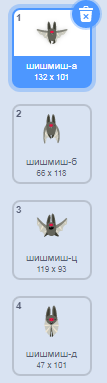
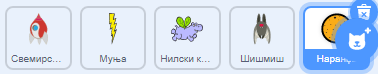

## Свемирски шишмиш

To make your game a bit harder, you are going to create a bat that throws oranges at the spaceship.


\--- task \---

Додај лик `Шишмиш` и постави негову ротацију на **лево–десно**.

\--- /task \---

\--- task \---

Make the `Bat` sprite `move`{:class="block3motion"} from left to right at the top of the Stage `forever`{:class="block3control"}.


```blocks3
када је кликнуто на ⚑
нека величина буде (50) %
понављај заувек 
  иди (10) корака
  ако си на рубу, окрени се
end
```

Не заборави да испробаш свој код.

\--- /task \---

If you look at the bat's costumes, you can see that it has four different ones:



\--- task \---

Use the `next costume`{:class="block3looks"} block to make the bat flap its wings as it moves.

\--- hints \---

\--- hint \---

After the bat has moved, it should show the `next costume`{:class="block3looks"} and then `wait`{:class="block3control"} for a short time.

\--- /hint \---

\--- hint \---

You need to add these blocks to you code:

```blocks3
чекај (0.3) секунду

следећи костим
```

\--- /hint \---

\--- hint \--- Твој код би требао да изгледа овако:

```blocks3
када је кликнуто на ⚑
нека величина буде (50) %
понављај заувек 
  иди (10) корака
  ако си на рубу, окрени се

+ следећи костим
+ чекај (0.3) секунду
end
```

\--- /hint \---

\--- /hints \---

\--- /task \---

Сада направи да шишмиш баца наранџе!

\--- task \---

Додај лик `Наранџе` из библиотеке Скреча.



\--- /task \---

\--- task \---

Додај код свом шишмишу, тако да `када је кликнуто на заставицу`{:class="block3events"}, лик `Шишмиш` `понавља заувек`{:class="block3control"} `чекај`{:class="block3control"} на `случајну`{:class="block3operators"} количину времена између `5 и 10`{:class="block3operators"} секунди, а затим `направи дупликат`{:class="block3control"} од лика `Наранџа`.


```blocks3
када је кликнуто на ⚑
понављај заувек 
  чекај (случајан број од (5) до (10)) секунду
  направи дупликат од (Наранџа v)
end
```

\--- /task \---

\--- task \---

Add code to the `Orange` to make each of its clone drop, starting from the `Bat` sprite and falling towards the bottom of the Stage.


```blocks3
    када је кликнуто на ⚑
сакриј

када се појавим као умножак
иди до (Шишмиш v)
прикажи
понављај до <додирује ли (edge v)? 
  промени y за (-4)
end
обриши овај умножак
```

\--- /task \---

\--- task \---

Add some more code to the `Orange` sprite so that when an `Orange` clone hits the `Spaceship` sprite, the clone also disappears to give the player a chance to reset:


```blocks3
    када примим [ударац v]
обриши овај умножак
```

\--- /task \---

\--- task \---

Modify the code of your `Spaceship` sprite so that the sprite is "hit" when it touches a `Hippo` sprite or an `Orange` sprite:


```blocks3
    чекај док не <<touching (Hippo1 v)?> или <touching (Orange v)?>>
```

\--- /task \---

\--- task \---

Test your game. What happens if the spaceship gets hit by a falling orange?

\--- /task \---