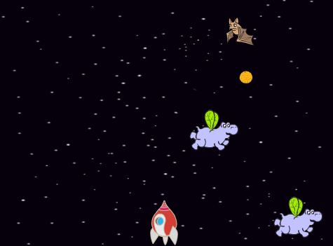

\--- no-print \---

This is the **Scratch 3** version of the project. There is also a [Scratch 2 version of the project](https://projects.raspberrypi.org/en/projects/clone-wars-scratch2).

\--- /no-print \---

## Вступ

У цьому проекті ви дізнаєтеся як створити гру, в якій ви повинні врятувати Землю від космічних монстрів.

### Що ви будете робити

\--- no-print \---

Click the green flag in the example game below to start, and then press the <kbd>left</kbd> and <kbd>right</kbd> arrow keys to move the spaceship, and the <kbd>space</kbd> key to shoot.

  <iframe allowtransparency="true" width="485" height="402" src="https://scratch.mit.edu/projects/embed/276887163/?autostart=false" frameborder="0" scrolling="no"></iframe>
  

\--- /no-print \---

Score as many points as you can by shooting flying space-hippos. If you get hit by a hippo or by an orange dropped by the bats, you lose a life.

\--- print-only \---

\--- /print-only \---

\--- collapse \---

* * *

## title: What you will need

### Обладнання

+ Комп'ютер, що підтримує Scratch 3

### Програмне забезпечення

+ Scratch 3 (either [online](https://rpf.io/scratchon){:target="_blank"} or [offline](https://rpf.io/scratchoff){:target="_blank"})

### Downloads

[Find the downloads here](http://rpf.io/p/en/clone-wars-go).

\--- /collapse \---

\--- collapse \---

* * *

## title: What you will learn

+ How to make sprites move using keyboard input
+ How to clone sprites to make copies of them
+ How to use 'broadcast' and 'receive blocks' to send messages

\--- /collapse \---

\--- collapse \---

* * *

## title: Additional notes for educators

\--- no-print \---

Якщо вам потрібно роздрукувати цей проект, будь ласка скористайтеся [ версією для друку ](https://projects.raspberrypi.org/en/projects/clone-wars/print) {: target = "_ blank"}.

\--- /no-print \---

[If you need the solution to this project, you can find it here](http://rpf.io/p/en/clone-wars-get).

\--- /collapse \---