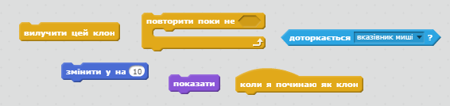

## Блискавка

Надайте здатність космічному кораблю стріляти блискавками!

+ Додайте спрайт `блискавки` з Scratch бібліотеки.

+ Коли гра почнеться, спрайт `блискавка` слід приховати до тих пір, поки космічний корабель не почне стріляти лазерними гарматами, тому додайте цей код до спрайту ` блискавки`:

```blocks
коли натиснуто ⚑
сховати
```

Зараз ви маєте досить велику блискавку, щоб стріляти в космічний корабель!

+ Прикріпіть код внизу блоків, які ви щойно додали, щоб зробити спрайт `блискавки` меншим і переверніть його. Тоді це буде виглядати як вогонь, що вистрілює із загостреного кінця космічного корабля.

```blocks
задати розмір (25) %
повернути в напрямку (-90 v)
```

+ Перейдіть на `Космічний корабель` спрайт, натиснувши на панелі Спрайти внизу Сцени.

+ Додайте новий код, щоб змусити спрайт `Космічного корабля` випускати нові блискавки з натиском на клавішу ** пробіл**.

\--- hints \--- \--- hint \--- Ось псевдокод для вас:

Коли натиснуто зелений прапорець, перевірте чи стврюється клон для спрайта `блискавки` при натисканні на клавішу **пробіл**. \--- /hint \--- \--- hint \--- Ось блоки, які вам потрібні:

 \--- /hint \--- \--- hint \--- Це код, який вам потрібен:

```blocks
коли натиснуто ⚑
завжди 
  якщо <key [space v] pressed?> то 
    створити клон з [Блискавка v]
  end
end
```

\--- /hint \--- \--- /hints \---

+ Поверніться назад до спрайта `блискавки`.

+ Кожного разу коли створюється блискавка, вона повинна з'явитися і тоді рухатися вгору поки не досягне верхньої частини екрану. Тоді блискавка має зникнути.

\--- hints \--- \--- hint \---

Коли новий клон спрайта `блискавки` з'являється:

+ Відобразіть це
+ Систематично рухайте його вгору до `10` поки він не торкнеться краю екрану
+ Потім видаліть клона \--- /hint \--- \--- hint \--- Це блоки, які вам потрібні:

 \--- /hint \--- \--- hint \--- Це код, який вам буде потрібно додати до спрайта `блискавки`:

```blocks
    коли я починаю як клон
показати
повторити поки не <touching [edge v] ?> 
  змінити y на (10)
end
вилучити цей клон
```

\--- /hint \--- \--- /hints \---

+ Перевірте ваш спрайт `блискавки` натиснувши зелений прапорець, і тоді натисніть клавішу **пробіл**. Коли ви натискаєте **пробіл**, Блискавка з'являється і рухається вверх екрану? Яку проблему ви можете помітити?

## \--- collapse \---

## title: Відповідь

На жаль, в даний момент блискавка завжди з'являється в одному і мому ж місці, незалежно від того, де знаходиться корабель!

Додайте цей блок перед блоком `показати`{:class="blocklooks"}, щоб зробити клона спрайта `блискавки`, щоб він рухався до позиції спрайта `Космічного корабля`, до того як він з'явиться. Тоді це буде виглядати так, ніби блискавка вистрілює з космічного корабля.

```blocks
перейдіть до [Космічний корабель v]
```

-- /collapse \---

+ Натисніть клавішу **пробіл**, щоб перевірити чи ваша блискавка зараз стріляє правильно.

\--- challenge \---

### Завдання: зафіксуйте блискавку

Що станеться, якщо утримувати клавішу **пробіл**? Чи можете ви використати блок ` чекати` {:class="blockcontrol"}, щоб виправити це?

\--- /challenge \---