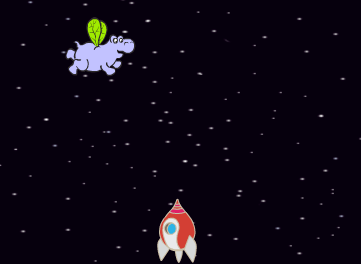
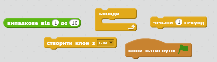
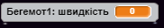
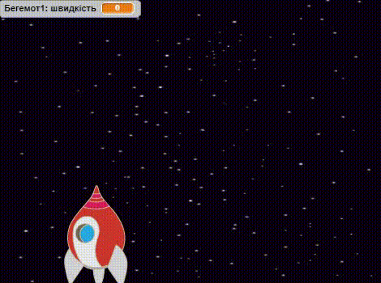

## Літаючі космічні бегемоти

Додайте багато літаючих бегемотів, які будуть намагатися знищити ваш космічний корабель.

+ Створіть новий спрайт з зображенням `Бегемот 1 ` в Скретч бібліотеці. Використайте інструмент **зменшити** для створення спрайту `бегемота` схожого розміру до спрайту `Космічного корабля`.



+ Встановіть стиль обертання спрайту `бегемот` лише зліва направо.

[[[generic-scratch-sprite-rotation-style]]]

+ Додайте код, щоб приховати спрайт `бегемота`, коли починається гра.

\--- hints \--- \--- hint \--- Код для цього, такий самий, як код, який ви використовували, щоб приховати спрайт `блискавки`, коли гра починається. \--- /hint \--- \--- hint \--- Код який вам потрібен:

```blocks
коли натиснуто ⚑
сховати
```

\--- /hint \--- \--- /hints \---

+ Перейдіть на Сцену, натиснувши на її іконку на нижній панелі.

+ Додайте код до Сцени, щоб створювати нового бегемота кожних кілька секунд.

\--- hints \--- \--- hint \--- Коли зелений прапорець натискається постійно...

+ Зачекайте 2-4 секунди
+ Створіть копію спрайта бегемота

\--- /hint \--- \--- hint \--- Це блоки, які вам потрібні: 

\--- /hint \--- \--- hint \--- Це код, який вам потрібен:

```blocks
коли натиснуто ⚑
завжди 
  чекати (випадкове від (2) до (4)) секунд
  створити клон з [Бегемот v]
end
```

\--- /hint \--- \--- /hints \---

+ Поверніться назад до спрайта `бегемота`.

Кожен новий бегемот має з'являтися у випадковому позиції х, і кожен має мати випадкову швидкість.

+ Створіть нову змінну з назвою `швдкість`{:class="blockdata"} лише для спрайту `Бегемот`.

[[[generic-scratch-add-variable]]]

Ви будете знати, що зробили це правильно коли побачите, що змінна має назву спрайту біля нього, наприклад:



+ Коли кожнен клон бегемота з'являється, виберіть випадкову швидкість та місце старту перш ніж показувати його на екрані.

```blocks
коли я починаю як клон
надати [швидкість v] значення (випадкове від (2) до (4))
перемістити в x: (випадкове від (-220) до (220)) y: (150)
показати
```

+ Протестуйте свій код, натиснувши на зелений прапорець. Новий бегемон з'являється кожні кілька секунд? На даний момент ваші бегемоти не рухаються.

+ Бегемот повинен рухатися як-небудь, поки в нього не потрапить блискавка. Щоб це сталося, додайте цей код внизу блоків, які ви вже додали:

```blocks
повторити поки не <touching [lightning v] ?> 
  перемістити на (швидкість) кроків
  поворот ↻ (випадкове від (-10) до (10)) градусів
  відбивати від меж
end
вилучити цей клон
```

+ Протестуйте код вашого бегемота. Ви повинні побачити нового клона бегемота, який буде з'являтися кожні кілька секунд, і кожен з яких рухатиметься зі своєю швидкістю.
    
    

+ Перевірте лазерну гармату. Коли ви влучили в бегемота, він розчинився?