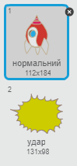
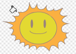

## Вибух космічного корабля

Коли бегемот торкається космічного корабля, корабель повинен вибухнути!

+ Виберіть спрайт `Космічний корабель` і перейменуйте образ на 'нормальний'.

+ Намалюйте інший образ для космічного корабля, що вибухне і назвіть його 'удар'.



Або, якщо ви не хочете малювати вибух, ви можете вибрати образ 'Сонце' з Скретч бібліотеки, і використати інструмент ** Колір форми** для зміни кольору та скидання обличчя.



+ Додайте код до спрайту `Космічного корабля` так, щоб він почав відображав образ космічного корабля, але коли корабель торкнеться до літаючого бегемота, то образ має змінитися на 'удар':

```blocks
коли натиснуто ⚑
змінити образ на [нормльний v]
чекати поки <touching [Hippo1 v]>
змінити образ на [удар v]
```

+ Перевірте свій код, зігравши у гру та зіткнувшись з бегемотом. Чи змінюється образ космічного корабеля на 'удар'?