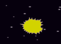

## Зникаючі бегемоти

Всі бегемоти повинні зникнути при ударі з космічним кораблем, щоб дати гравцю можливість відновити життя.

+ Додайте блок до коду, щоб `транслювати` повідомлення "удар", коли космічний корабель доторкнеться до бегемота.

[[[generic-scratch-broadcast-message]]]

\--- hints \--- \--- hint \--- Створіть `трансляцію` 'удар' блоку, перетягуючи блок з вкладки **Події** і потім натисніть на спадне меню та виберіть **нове повідомлення**. \--- /hint \--- \--- hint \--- Так повинен виглядати ваш блок:

```blocks
оповістити [удар v]
```

\--- /hint \--- \--- hint \--- Так повинен виглядати ваш блок:

```blocks
коли натиснуто ⚑
змінити образ на [нормальнийv]
чекати поки <touching [Hippo1 v]>
змінити образ на [удар v]
оповістити [удар v]
```

\--- /hint \--- \--- /hints \---

Всі клони спрайта `бегемот` почують це повідомлення, тому ви можете навчити їх зникати, коли вони вдаряються об космічний корабель.

+ Додайте цей код до спрайту `Бегемот`:

```blocks
коли я отримаю [удар v]
вилучити цей клон
```

+ Протестуйте цей код, запустивши нову гру, та навмисно зіткніться з бегемотом.



Після того, як корабель вдарять, бегемоти почнуть з'являтися знову, але космічний корабель вибухне! Давайте зробимо можливим, щоб космічний корабель повернувся в початкове положення після удару.

+ Додайте блок ` завжди ` {: class = "blockcontrol"} навколо всього вашого коду, щоб процес повторювався, та блок ` чекати ` {: class = "blockcontrol"} в кінці, щоб додати невелику паузу, перш ніж бегемоти з'являться знову.

```blocks
коли натиснуто ⚑
завжди 
  змінити образ на [нормальний v]
  чекати поки <touching [Hippo1 v]>
  змінити образ на [удар v]
  оповістити [удар v]
  чекати (1) секунд
end
```

\--- challenge \---

### Challenge: життя і рахунок

На даний момент гравець має нескінченне життя. Чи можете ви додати `Життя`:class="blockdata"}, `рахунок`{:class="blockdata"}, чи навіть `рекорд` {:class="blockdata"} до вашої гри?

[[[generic-scratch-high-score]]] \--- /challenge \---