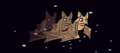
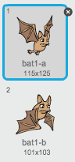
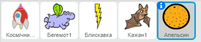

## Фруктовий кажан

Щоб зробити гру тріши складнішою, зробіть фруктового кажана, який кидає апельсини в космічний корабель.

+ Додайте спрайт `Кажана` та зафіксуйте його стиль обертання тільки з **ліва направо**.

+ Змусьте спрайт `Кажана` для `рухатися` {:class="blockmotion"} з однієї сторони вгорі на сцені `завжди`{:class="blockcontrol"}. Не забудьте перевірити свій код.



\--- hints \--- \--- hint \--- Коли прапорець натиснутий, спрайт `Кажан` повинен завжди

+ робити 10 кроків
+ якщо досягне краю, стрибати \--- /hint \--- \--- hint \--- Код, який вам потрібен:

```blocks
коли натиснуто ⚑
завжди 
  перемістити на (10) кроків
  відбивати від меж
end
```

\--- /hint \--- \--- /hints \---

Якщо ви подивитеся на образи кажана, то побачите, що він має вже два різних:



+ Скористайтеся блоком `наступний образ`{:class="blocklooks"}, щоб кажан шумів крилами, коли він рухається.

\--- hints \--- \--- hint \--- Після того, як кажан порухався, він повинен показати ` наступний образ`{:class="blocklooks"} і тоді `чекати`{:class="blockcontrol"} короткий час. \--- /hint \--- \--- hint \--- Код, який вам потрібен:

```blocks
наступний образ
чекати (0.3) секунд
```

\--- /hint \--- \--- hint \--- Код, який вам потрібно буде додати:

```blocks
коли натиснуто ⚑
завжди 
  перемістити на (10) кроків
  відбивати від меж
  наступний образ
  чекати (0.3) секунд
end
```

\--- /hint \--- \--- /hints \---

Тепер зробіть кажану апельсин, яким він буде кидатися.

+ Додайте новий спрайт `Апельсин` з бібліотеки Скреч.



+ Додайте код для кажана так, щоб при натисканні на прапорець, він чекав від 5 до 10 секунд, і тоді створіть копію для спрайту `Апельсин`.

\--- hint \--- \--- hint \--- Подивіться на код, який ви написали для створення спрайту `Блискавка`. Тепер потрібен дуже схожий код, проте замість того, щоб апельсини з'являлися коли ви натискаєте **пробіл**, вони повинні з'явитися після того, як ви `чекаєте`{:class="blockcontrol"} `5-10 `{:class="blockoperators"} секунд. \--- /hint \--- \--- hint \--- `Коли прапорець натиснутий`{:class="blockcontrol"},спрайт `Кажан` повинен `завжди`{:class="blockcontrol"}

+ `чекати`{:class="blockcontrol"} `випадковий`{:class="blockcontrol"} проміжок часу між `5-10` {:class="blockoperators"} секундами
+ `створіть копію ` {:class="blockcontrol"} спрайту `Апельсин` \--- /hint \--- \--- hint \--- Код, який вам потрібен:

```blocks
коли натиснуто ⚑
завжди 
  чекати (випадкове від (5) до (10)) секунд
  створити клон з [Апельсин v]
end
```

\--- /hint \--- \--- /hints \---

+ Натисніть на спрайт `Апельсин` і додайте код, щоб змусити кожного клона спрайта `Апельсин` падати від спрайту `Кажана` до нижньої частини сцени.

\--- hints \--- \--- hint \--- Цей код, який вам потрібен, майже такий самий, як код всередині спрайту `Блискавиці`, окрім того, що спрайт `Апельсини` повинен `перейти до `{:class="blockmotion"} позиції спрайту `Кажан`, і він повинен використати `зміну у до` {:class="blockcontrol"} блоку, щоб рухатися вниз а не вгору. \--- /hint \--- \--- hint \--- Це код, який вам потрібен:

```blocks
    коли натиснуто ⚑
сховати

коли я починаю як клон
перемістити в [Кажан1 v]
показати
повторити поки не <доторкається [межа v]?> 
  змінити y на (-4)
end
вилучити цей клон

```

\--- /hint \--- \--- /hints \---

+ Додайте ще один код для спрайту `Апельсин` так, щоб, коли він ударяв спрайт `Космічний корабель`, він також зникав, щоб дати гравцю можливість повернутися в початкове положення:

```blocks
    коли я отримаю [удар v]
вилучити цей клон
```

+ Такаж, вам потрібно буде змінити код до спрайту `Космічного корабля` так, щоб він змінювався образ на "удар", коли він торкнеться спрайту `Бегемота` чи спрайту `Апельсин`:

```blocks
    чекати поки <<доторкається [Бегемот v]?> або <доторкається [Апельсин v]?>>
```

+ Протестуйте гру. Що станеться, якщо в вас влучить апельсин?