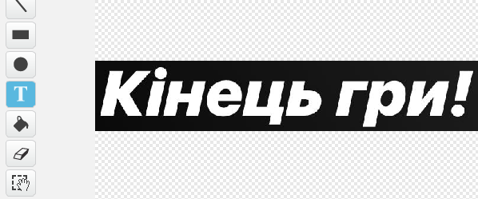

## Кінець гри

В кінці гри додайте повідомлення 'Кінець гри'.

+ Якщо ви цього ще не зробили, створіть нову змінну під назвою `Життя` {:class="blockdata"}.

Ваш космічний корабель повинен мати три життя на початку гри і втрачати життя, коли він торкається бегемота або апельсинів. Ваша гар має закінчитися, коли ви втратите всі життя. Якщо вам потрібна допомога, ви можете скористатися проектом [Спіймай точку](https://codeclubprojects.org/en-GB/scratch/catch-the-dots/), який допоможе вам.

+ Намалюйте новий спрайт з назвою `Кінець гри!` використовуючи інструмент **текст**.



+ На вашій сцені транслюйте повідомлення ` кінець гри!` {: class = "blockevents"} безпосередньо перед закінченням гри.

```blocks
оповістити [Кінець гри! v] і чекати
```

+ Додайте цей код до спрайту ` Кінець гри!` так, щоб повідомлення з'являлося в кінці гри:

```blocks
коли натиснуто ⚑
сховати

коли я отримаю [Кінець гри! v]
показати
```

Оскільки ви використали блок ` транслювати [Кінець гри!] і чекати ` {: class = "blockevents"} на вашій сцені, він буде чекати на спрайт ` Кінець гри!`, який відображатиметься перед закінченням гри.

+ Протестуйте свою гру. Скільки балів ви можете набрати? Якщо це занадто легко чи складно, чи можете ви подумати про те, як покращити свою гру?