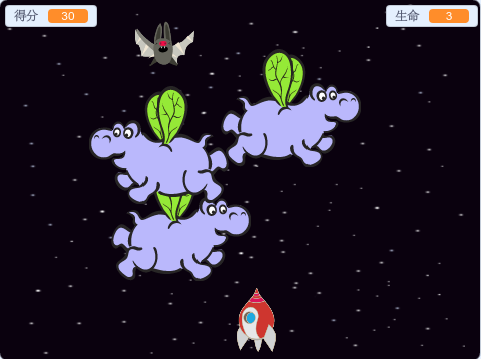

\--- no-print \---

这个项目是基于**Scratch 3**版本的，另外还有一个基于[Scratch 2的版本](https://projects.raspberrypi.org/en/projects/clone-wars-scratch2)。

\--- /no-print \---

## 简介

在这个项目中，您将学习如何创建一个游戏，游戏中您必须拯救地球免受太空怪物的侵害。

### 您将制作：

\--- no-print \---

点击下面的示例游戏中的绿色旗帜开始，然后按 <kbd>左</kbd>和<kbd>右</kbd> 箭头键移动飞船， <kbd>空格</kbd> 键来射击。

  <iframe allowtransparency="true" width="485" height="402" src="https://scratch.mit.edu/projects/embed/276887163/?autostart=false" frameborder="0" scrolling="no"></iframe>
  

\--- /no-print \---

通过射击飞行的太空河马，尽可能多的得分。如果您被河马击中，或者被蝙蝠扔下的橙子击中，您就会失去一条命。

\--- print-only \---

\--- /print-only \---

\--- collapse \---

* * *

## title: 您需要准备什么

### 硬件

+ 一台能够运行Scratch 3的电脑

### 软件

+ Scratch 3（[在线版本](https://rpf.io/scratchon){:target="_blank"}或[离线版本](https://rpf.io/scratchoff){:target="_blank"}）

### 下载

[在此处下载](http://rpf.io/p/en/clone-wars-go) 。

\--- /collapse \---

\--- collapse \---

* * *

## title: 你将学到什么

+ 如何使用键盘输入移动角色
+ 如何克隆角色以制作副本
+ 如何使用“广播”和“接收模块”发送消息

\--- /collapse \---

\--- collapse \---

* * *

## 题目: 教师附加说明

\--- no-print \---

如果您需要打印本项目文件，请使用[适合打印版本](https://projects.raspberrypi.org/en/projects/clone-wars/print){:target="_blank"}。

\--- /no-print \---

你可以在这里找到[完整的项目](http://rpf.io/p/en/clone-wars-get).

\--- /collapse \---