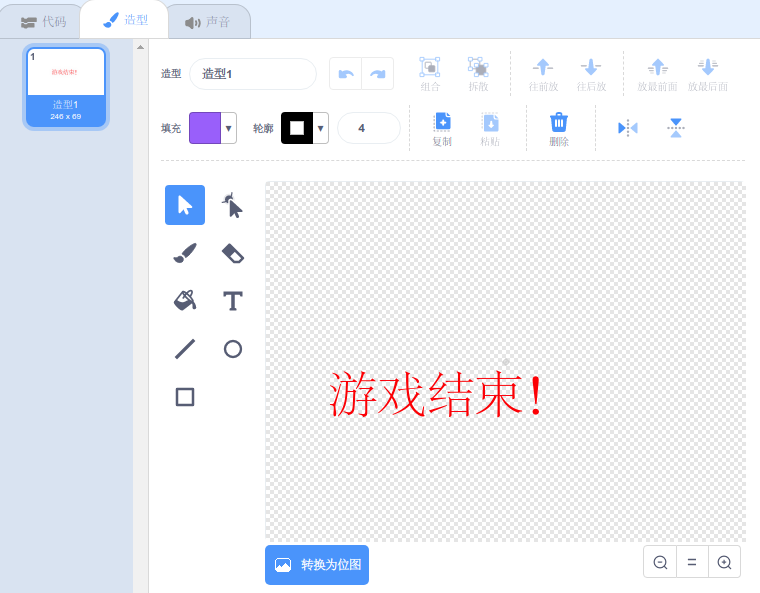

## 游戏结束

接下来，您将在游戏末尾添加一条“游戏结束”的消息。

\--- task \---

如果您尚未创建，请创建一个新变量，名为 `生命`{:class="block3variables"}。

您的宇宙飞船应该从三条生命开始。每当您的宇宙飞船碰到一只河马或一只橘子时失去一条生命。 当`生命`{:class="block3变量"} 耗尽时，你的游戏应该停止。

\--- /task \---

\--- task \---

绘制一个名为` 游戏结束`的新角色，使用**文本**工具。



\--- /task \---

\--- task \---

在舞台上，游戏正好结束之前播放一条`游戏结束` {:class =“ block3events”}的消息。


```blocks3
broadcast (game over v) and wait
```

\--- /task \---

\--- task \---

将此代码添加到您的` 游戏结束 `角色，使其在游戏结束时显示：


```blocks3
when flag clicked
hide

when I receive [game over v]
show
```

因为您已经在舞台上使用了一个`广播(游戏结束)并等待`{:class="block3events"} 代码块， 舞台将等`游戏结束`角色显示后才结束游戏。。广播

\--- /task \---

\--- task \---

测试您的游戏。您可以得多少分？如果游戏太简单或太难，您能想到改善它的方法吗？

\--- /task \---