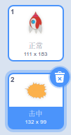
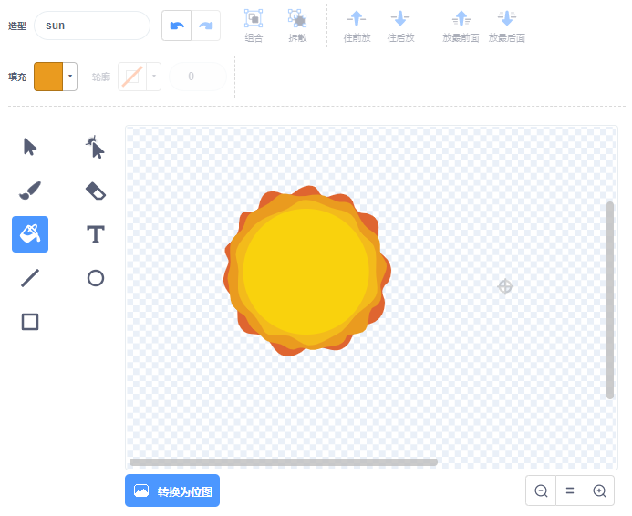

## 爆炸的宇宙飞船

当河马碰到您的飞船时，飞船应爆炸！

\--- task \---

选择`宇宙飞船`角色，并将其造型命名为“正常”。

\--- /task \---

\--- task \---

画出另一只爆炸飞船的造型，并将新造型称为“命中”。



如果您不想绘制爆炸，您可以从Scratch库中选择“太阳”造型， 然后使用 **为形状着色** 工具来更改造型的颜色和面。



\--- /task \---

\--- task \---

在您的`宇宙飞船` 角色中添加一些代码，以便在游戏开始时显示“正常”造型，并在触碰到河马时切换为“命中”造型：


```blocks3
当 ⚑ 被点击
换成 (normal v) 造型
等待 <touching (Hippo1 v)>
换成 (hit v) 造型
```

\--- /task \---

\--- task \---

测试您的代码。使飞船与河马相撞。宇宙飞船会切换成“命中”的造型吗？

\--- /task \---