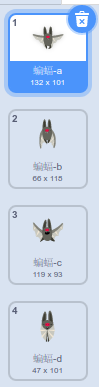
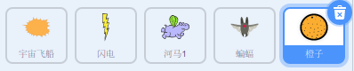

## 太空蝙蝠

为使您的游戏变得更有难度一点，您将要创建一个向飞船扔橙子的蝙蝠。


\--- task \---

添加一个`蝙蝠`角色并将其旋转风格设置为 **左-右**。

\--- /task \---

\--- task \---

使`蝙蝠`角色在舞台顶部从左至右`移动`{:class="block3motion"}`重复执行`{:class="block3control"}。


```blocks3
when flag clicked
set size to (50) %
forever
    move (10) steps
    if on edge, bounce
end
```

请记得测试您的代码。

\--- /task \---

如果您看一下蝙蝠的造型，您会发现它有四种不同的造型：



\--- task \---

使用`下一个造型` {:class =“ block3looks”}代码块使蝙蝠在移动时拍打翅膀。

\--- hints \---

\--- hint \---

蝙蝠移动后，应显示`下一个造型` {:class =“ block3looks”}，然后`等待` {:class =“ block3control”}一小段时间。

\--- /hint \---

\--- hint \---

您需要将这些代码块添加到您的代码中：

```blocks3
wait (0.3) seconds

next costume
```

\--- /hint \---

\--- hint \---

你的代码应该像这样：

```blocks3
when flag clicked
set size to (50) %
forever
move (10) steps
if on edge, bounce

+ next costume
+ wait (0.3) seconds
end
```

\--- /hint \---

\--- /hints \---

\--- /task \---

现在让蝙蝠扔橙子！

\--- task \---

从 Scratch 库添加一个 `Orange`角色。



\--- /task \---

\--- task \---

将代码添加到你的蝙蝠角色，以便`当绿色旗帜被点击时`{:class="block3events"}, `蝙蝠` 角色`重复执行`{:class="block3control"} `等待`{:class="block3control"}一个`随机的`{:class="block3operators"}时间为`5-10`{:class="block3operators"}秒，然后`创建一个克隆`{:class="block3control"}`橙子`角色。


```blocks3
when flag clicked
forever
    wait (pick random (5) to (10)) secs
    create clone of (Orange v)
end
```

\--- /task \---

\--- task \---

将代码添加到`橙子`，以使其每个克隆都从`蝙蝠`角色上开始向舞台底部掉落。


```blocks3
    when flag clicked
    hide

    when I start as a clone
    go to (Bat v)
    show
    repeat until <touching (edge v)?
        change y by (-4)
    end
    delete this clone
```

\--- /task \---

\--- task \---

将更多代码添加到`橙子`上，以便当一个`橙子`的克隆击中`太空飞船`时， 克隆也消失，让玩家有机会重置：


```blocks3
    当接收到 [hit v]
删除此克隆体
```

\--- /task \---

\--- task \---

修改你的`飞船`角色的代码，使它在碰到`河马`或`橙子`角色时被“击中”：


```blocks3
    until < <touching (Hippo1 v)?> or <touching (Orange v)?>>
```

\--- /task \---

\--- task \---

测试你的游戏。如果飞船被正在坠落的橙子撞到，会发生什么情况？

\--- /task \---