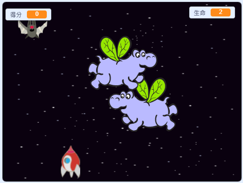

\---沒有印刷\---

這是該項目的 **Scratch 3** 版本。項目</a>還有 Scratch 2版本。
 

\--- /無印刷\---

## 介紹

在這個項目中，您將學習如何創建一個遊戲，您必須從太空怪物中拯救地球。

### 你要做什麼

\---沒有印刷\---

單擊下面示例遊戲中的綠色標誌開始，然後按 <kbd>左</kbd> 和 <kbd>右</kbd> 箭頭鍵移動飛船，並按 <kbd>空格鍵</kbd> 進行拍攝。

  <iframe allowtransparency="true" width="485" height="402" src="https://scratch.mit.edu/projects/embed/276887163/?autostart=false" frameborder="0" scrolling="no"></iframe>
  

\--- /無印刷\---

通過射擊飛行空間 - 河馬得分盡可能多的分數。如果你受到河馬或蝙蝠掉落的橙色的打擊，你就會失去生命。

\---只打印\---

\--- /僅打印\---

## \--- collapse \---

## title: What you will need

### 硬件

+ 能夠運行Scratch 3的計算機

### 軟件

+ 從頭開始3（ [在線](https://rpf.io/scratchon){：target =“_ blank”}或 [離線](https://rpf.io/scratchoff){：target =“_ blank”}）

### 下載

[Find the downloads here](http://rpf.io/p/en/clone-wars-go).

\--- /collapse \---

## \--- collapse \---

## title: What you will learn

+ 如何使用鍵盤輸入使精靈移動
+ 如何克隆精靈來製作它們的副本
+ 如何使用“廣播”和“接收塊”發送消息

- - /坍方 - -

## \--- collapse \---

## title: Additional notes for educators

\--- no-print \---

If you need to print this project, please use the [printer-friendly version](https://projects.raspberrypi.org/en/projects/clone-wars/print){:target="_blank"}.

\--- /no-print \---

You can find the [completed project here](http://rpf.io/p/en/clone-wars-get).

\--- /collapse \---