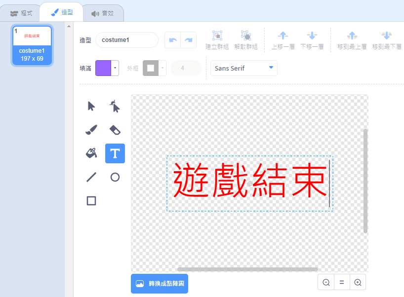
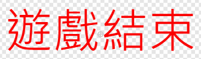

## 遊戲結束

接下來，您將在遊戲結束時添加“遊戲結束”消息。

\---任務\---

如果還沒有，請創建一個名為 `的新變量`{：class =“block3variables”}。

你的宇宙飛船應該從三個生命開始，一旦接觸河馬或橙色就會失去生命。你的遊戲應該在 `生命`{：class =“block3variables”}用完時停止。

\--- /任務\---

\---任務\---

使用 **文本** 工具繪製一個名為 `Game Over` 的新精靈。



\--- /任務\---

\---任務\---

在舞台上，在遊戲結束前，在</code>：{：class =“block3events”}消息上播放 `遊戲。</p>

<p></p>

<pre><code class="blocks3">廣播（遊戲超過v）並等待
`</pre> 

\--- /任務\---

\---任務\---

將此代碼添加到 `Game Over` 精靈中，以便在遊戲結束時顯示：



```blocks3
當標記點擊
時，當我收到[遊戲超過v]
節目時隱藏


```

因為您在舞台上使用了 `廣播（遊戲結束）並等待`{：class =“block3events”}阻止，所以舞台將等待 `遊戲結束` 精靈在結束遊戲之前顯示。

\--- /任務\---

\---任務\---

測試你的遊戲。你能得分多少分？如果遊戲太容易或太難，你能想出改進它的方法嗎？

\--- /任務\---