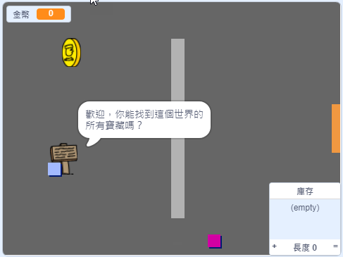

## 然後呢？

玩玩我們的[你的世界](https://projects.raspberrypi.org/zh-TW/projects/create-your-own-world?utm_source=pathway&utm_medium=whatnext&utm_campaign=projects)專案，你也要創造一個屬於自己的冒險遊戲！

--- no-print ---

點擊綠旗開始， 用方向鍵移動角色，在你的世界散散步。

  <iframe allowtransparency="true" width="485" height="402" src="https://scratch.mit.edu/projects/embed/396459737/?autostart=false" frameborder="0" scrolling="no"></iframe>
  

--- /no-print ---

--- print-only ---

逛逛你的世界，到處走走看看。 

--- /print-only ---

***
這個專案由以下志工翻譯：

Dnow Ba

余澄祐

感謝志工們，我們才能為來自世界各地的人們提供學習機會。你也可以擔任翻譯志工，幫我們創造更多機會，若要進一步瞭解，請造訪 [rpf.io/translate](https://rpf.io/translate)。