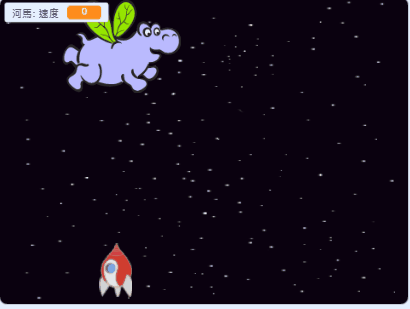

## 空間河馬

現在你要添加許多試圖摧毀你的宇宙飛船的飛行河馬。

\---任務\---

在Scratch庫中使用“Hippo1”圖像創建一個新的sprite。使用 **shrink** 工具使 `Hippo` 精靈的尺寸與 `Spaceship` 精靈相似。


\--- /任務\---

\---任務\---

將 `Hippo` 精靈的旋轉樣式設置為 **左右**。

[[[generic-scratch3-sprite-rotation-style]]]

\--- /任務\---

\---任務\---

添加一些代碼以在遊戲開始時隱藏 `Hippo` 精靈。


```blocks3
點擊綠色標誌時
隱藏
```

\--- /任務\---

\---任務\---

向舞台添加一些代碼，每隔幾秒鐘創建一個新的 `Hippo` 克隆。

\---提示\---

\---提示\---

當點擊 `綠色標誌時`{：class =“block3events”}， `反复`{{class =“block3control”} `等待`{：class =“block3control”} `在2和4秒之間`{：class = “block3operators”}然後 `創建一個Hippo sprite`{：class =“block3control”}的克隆。

\--- /提示\---

\---提示\---

以下是您需要的塊：

```blocks3
永遠
結束

創建克隆（Hippo1 v）

（挑選隨機（2）到（4））

當標記點擊

等待（）秒
```

\--- /提示\---

\---提示\---

這是你的代碼應該是這樣的：


```blocks3
當標誌點擊
永遠
    等待（隨機選擇（2）到（4））秒
    創建克隆（Hippo1 v）
結束
```

\--- /提示\---

\--- /提示\---

\--- /任務\---

每個新的河馬克隆應該出現在隨機的 `x` 位置，每個克隆應該具有隨機速度。

\---任務\---

創建一個名為 `speed`{：class =“block3variables”}的新變量，僅用於 `Hippo` 精靈。

[[[generic-scratch3-add-variable]]]

當你正確地完成這個操作後，變量旁邊會有精靈的名字，如下所示：


\--- /任務\---

\---任務\---

當每個 `Hippo` 克隆開始時，選擇一個隨機速度並開始它的位置。然後在屏幕上顯示克隆。

```blocks3
當我開始作為克隆
設置[速度v]到（選擇隨機（2）到（4））
轉到x :(選擇隨機（-220）到（220））y：（150）
顯示
```

\--- /任務\---

\---任務\---

測試你的代碼。每隔幾秒就會出現一隻新的河馬嗎？

\--- /任務\---

目前河馬不動了。

\---任務\---

每隻河馬應該隨機移動，直到它被閃電擊中。要實現這一點，請將此代碼附加到 `Hippo` sprite代碼腳本中已有的塊下面：

```blocks3
重複直到 <touching (lightning v) ?>
    移動（速度::變量）步驟
    向右轉（選擇隨機（-10）到（10））
    度如果在邊緣，反彈
結束
刪除此克隆
```

\--- /任務\---

\---任務\---

再次測試您的代碼。您應該會看到每隔幾秒就出現一個新的河馬克隆，每個克隆應該以不同的速度移動。

\---沒有印刷\---



\--- /無印刷\---

\--- /任務\---

\---任務\---

現在測試宇宙飛船的激光炮。如果閃電擊中河馬，河馬會消失嗎？

\--- /任務\---