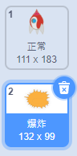
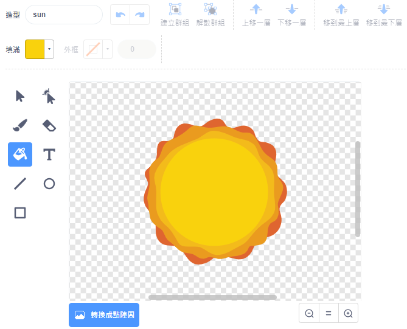

## 宇宙飛船爆炸

當河馬接觸你的宇宙飛船時，宇宙飛船應該爆炸！

\---任務\---

選擇 `Spaceship` 精靈並將其服裝重命名為“normal”。

\--- /任務\---

\---任務\---

畫出另一種爆炸式飛船的服裝，並將新服裝稱為“打擊”。



如果您不想繪製爆炸，可以從Scratch庫中選擇“Sun”服裝，然後使用 **Color a shape** 工具更改服裝的顏色和麵部。



\--- /任務\---

\---任務\---

在你的 `Spaceship` 精靈中添加一些代碼，以便在遊戲開始時顯示“普通”服裝，並在接觸河馬時切換到“命中”服裝：


```blocks3
當標誌點擊
切換服裝到（正常v）
等待 <touching (Hippo1 v)>？
開關服裝（打v）
```

\--- /任務\---

\---任務\---

測試你的代碼。讓宇宙飛船與河馬相撞。宇宙飛船是否會變成“熱門”服裝？

\--- /任務\---